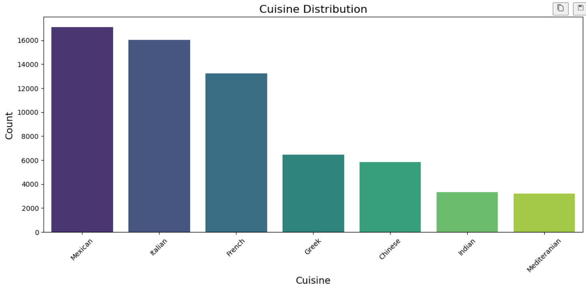
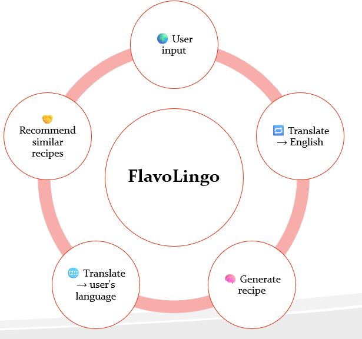

# 🧠 Flavolingo 🍳
## Multilingual Recipe Recommendation System Powered by AI and NLP

### 📌 Project Overview
Flavolingo is an intelligent recipe recommendation app that helps users discover dishes based on ingredients they like — across different languages and cuisines. With over 2 million recipes, it supports a global user base by translating ingredients, processing them with NLP, and recommending similar recipes.

Whether you're a foodie looking to explore international flavors or a developer exploring applied NLP, Flavolingo bridges the gap between language, culture, and cuisine.

### Dataset
The dataset used for this project is a collection of recipes in multiple languages. You can access the dataset here:
[Dataset Link - RecipeNLG](https://huggingface.co/datasets/mbien/recipe_nlg)

### 🧼 Data Preprocessing
The original recipe dataset contains messy and inconsistent entries. Here's how preprocessing was handled:

- ✅ **Cleaning text**: Lowercasing, removing special characters, trimming whitespace
- ✅ **Handling nulls**: Recipes with missing essential fields were removed
- ✅ **Normalization**: Ingredients and units were standardized
- ✅ **Tokenization & vectorization**: TF-IDF was used to convert ingredient lists into numerical vectors



### 🌍 Translation Method
Since the dataset includes recipes in multiple languages, a translation pipeline was built using:
- **fastText** for automatic language detection (lid.176.bin)
- **Marian MT (translation model)** for translating non-English ingredients to English

### 🤖 Recommendation System
The core of Flavolingo’s recommendation engine is:
- TF-IDF vectorization of ingredient lists
- TF-IDF vectorization of cuisin lists
- K-Nearest Neighbors (KNN) algorithm to find similar recipes based on vector proximity

### 🧠 Business Applications
- 🌎 **Multilingual food apps** for global users
- 🧠 **Smart kitchen assistants** that recommend meals based on available ingredients
- 🛒 **E-commerce integrations** to suggest grocery items
- 📱 **Mobile meal planners** powered by NLP
- 👩‍🍳 **Recipe personalization** based on cultural or dietary preferences

### 🧪 Challenges Faced
- 📉 **Shortage of data features**: The dataset lacked sufficient diversity in ingredient features, leading to limited recipe variety in recommendations.
- 🌍 **Translation accuracy**: Maintaining semantic accuracy across languages
- 🧹 **Data inconsistencies**: Ingredient names varied widely; normalization was tricky
- 🧠 **Platform Scalability Constraints**: Limited flexibility for adding multi-page flows or advanced UI.

### 🚀 Future Improvements
- ✅ Replace fastText with newer multilingual models (e.g., M2M-100, SeamlessM4T)
- ✅ Add filters (e.g., cooking time, cuisine, dietary restriction)
- ✅ Deploy as a fully hosted web app and mobile app
- ✅ Add voice/image input

### 🖥️ How to Use the App
Clone the repository:

```bash
git clone https://github.com/jhovanisabuchi/Flavolingo.git
cd Flavolingo
pip install -r requirements.txt
streamlit run streamlit_app/app.py
Input ingredients in any language
Get recipe and recommendations instantly
```




